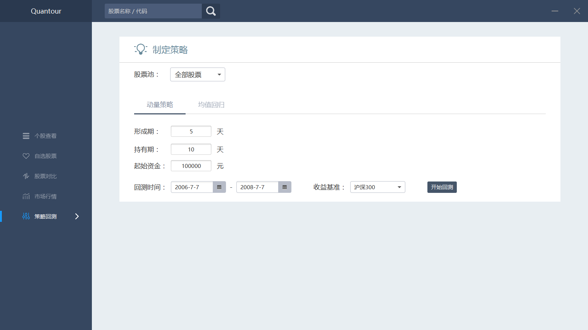
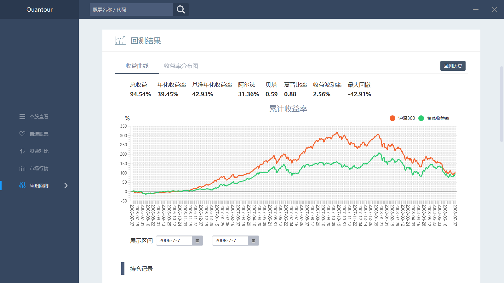
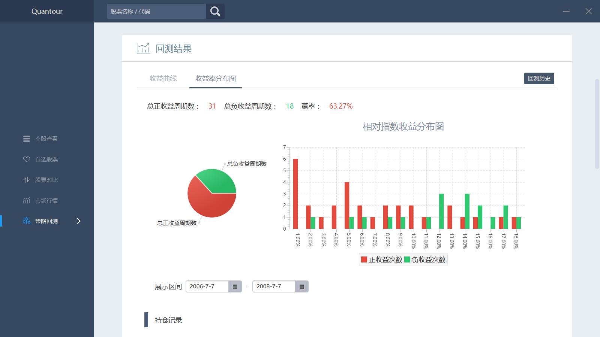
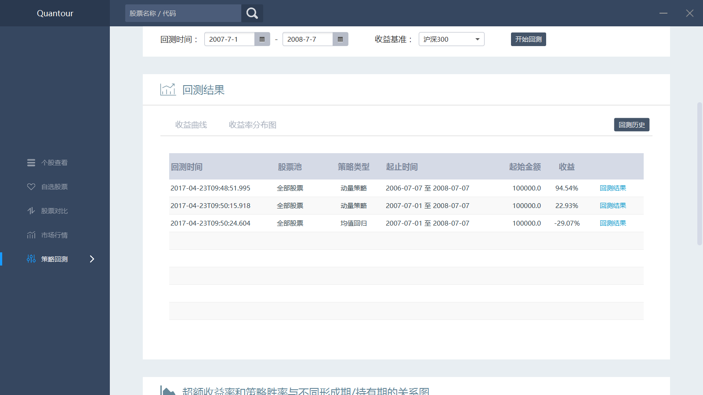
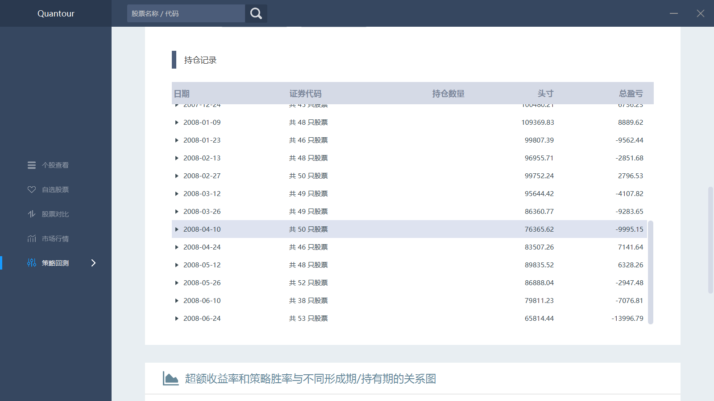
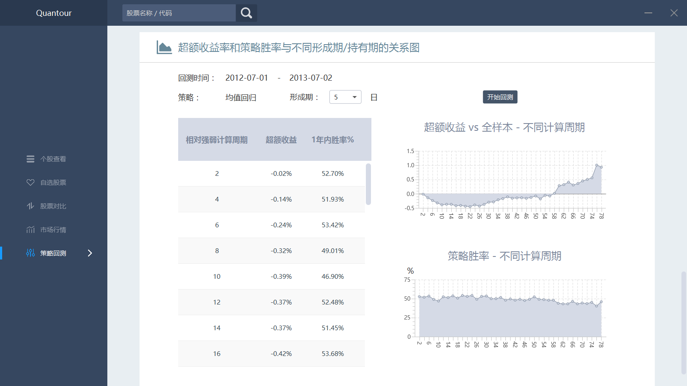
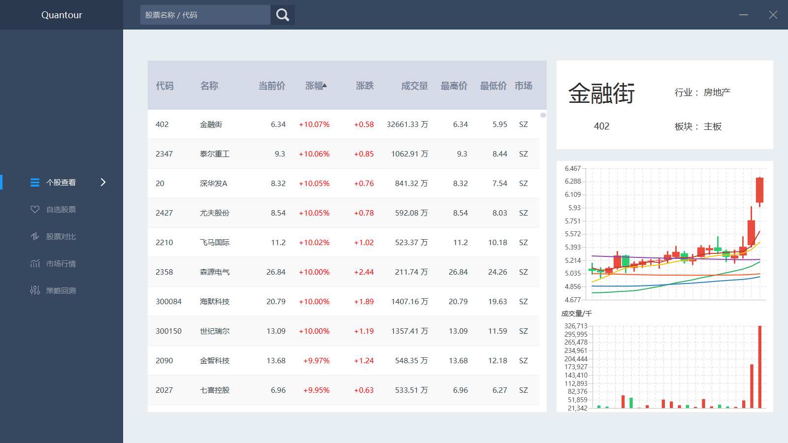
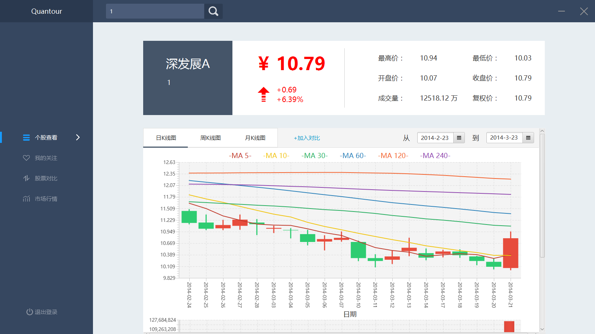
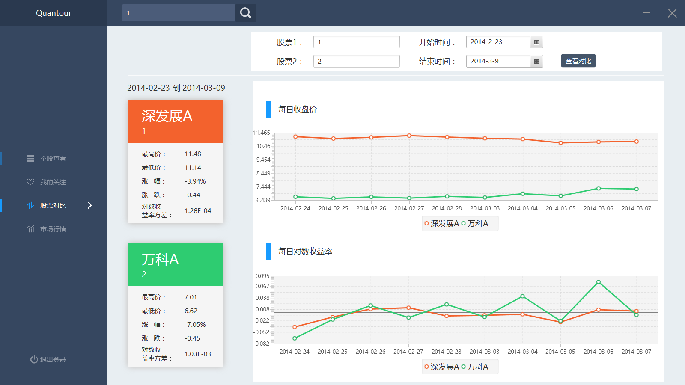
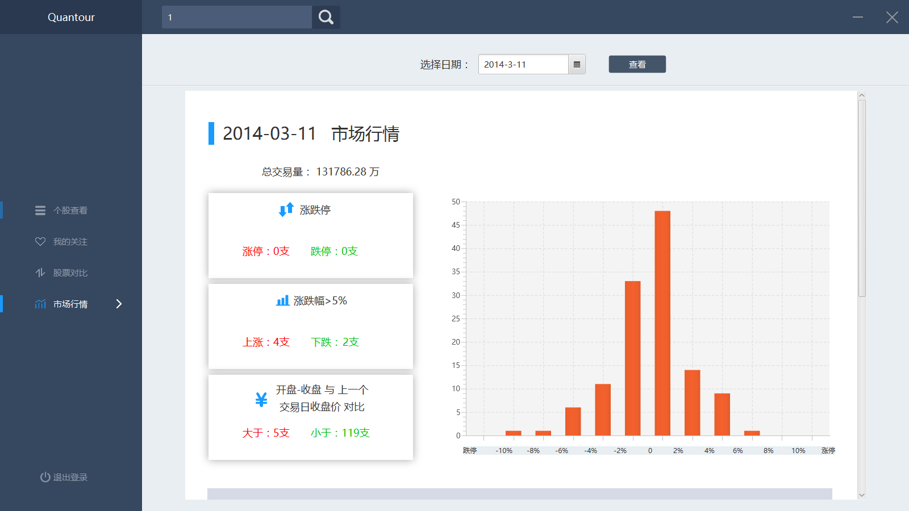

## Quantour
 迭代二采用javafx，在迭代一的基础上新增了新建自选股票池和策略回测的功能。 发布在 Release 目录下，双击 Quantour2.jar 即可运行，该目录下含有项目部署书。另外用run2.bat也可运行，主要是为了解决 Windows 可能出现的乱码问题。
 
 项目文档在Documents/迭代二目录下。
 
 
 截取项目截图，放在Iteration1、2/Quantour/项目截图 下。
 
### 迭代二新增部分
#### 制定策略界面，可选择股票池类型、策略类型等等。

#### 回测结果界面，展示收益率分布曲线，在下方可选择展示区间。

#### 回测结果界面，展示收益率分布图

#### 回测历史界面，点击回测结果可查看相应回测结果

#### 查看持仓记录

#### 超额收益率和策略胜率与不同形成期/持有期的关系图

### 迭代一的内容

